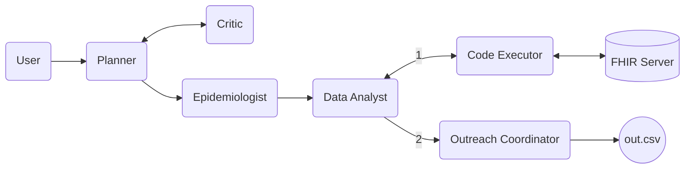

# Hospital GPT

This project is an implementation of [AutoGen](https://github.com/microsoft/autogen) to emulate the population health functions within a health system.

The end goal of the project is to develop an outreach plan for specific conditions, as inputed by the user. There are a number of team members involved in the project to complete this task.
- Hospital Administration / Planner
- Epidemiologist
- Data Analyst
- Outreach coordinator

## Organization
The agents interact as follows:


More details can be found in my [Medium Article](https://medium.com/@micklynch_6905/hospitalgpt-managing-a-patient-population-with-autogen-powered-by-gpt-4-mixtral-8x7b-ef9f54f275f1).

### Running Locally
In order to run the code locally, you need to create the following files:
1. OAI_CONFIG_LIST
2. .env

The contents of OAI_CONFIG_LIST are:
```
[
  {
   "model": "mistralai/Mixtral-8x7B-Instruct-v0.1",
   "api_key": "xxxxxxxxxxxxxxxxxxxx",
   "base_url": "https://api.deepinfra.com/v1/openai"
  },
  {
    "model": "gpt-4",
    "api_key": "xxxxxxxxxxxxxxxxxxxxxxx"
  }
]
```

The contents of .env file are:
```
OPENAI_API_KEY=xxxxxxxxxxxxxxxxx
```
