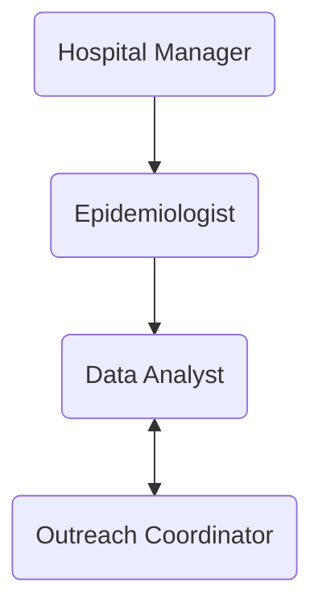

# Hospital GPT

This project is an implementation of [AutoGen](https://github.com/microsoft/autogen) to emulate the population health functions within a health system.

The end goal of the project is to develop an outreach plan for specific conditions, as inputed by the user. There are a number of team members involved in the project to complete this task.
- Hospital Administration / Planner
- Epidemiologist
- Data Analyst
- Outreach coordinator

## Organization
The organization interacts as follows:

## Process
The user identifies the condition that is to be addressed, e.g. "_Contact patients that are at risk of heart disease._".

    

## Conclusion
